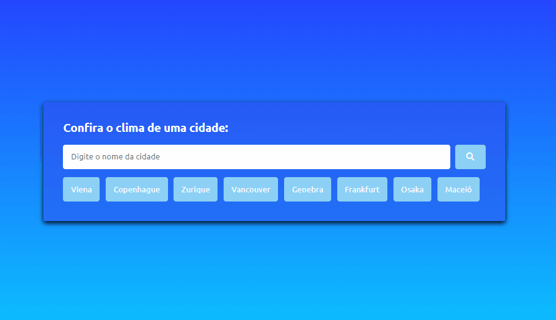

<h1>World Climate App</h1>

This is a simple web application that allows you to check the weather of a city. You can enter the name of the city and get information about the current temperature, humidity, wind, and weather conditions. You can also view the flag of the country where the city is located.

<h2>Technologies Used</h2>

HTML5<i class="fa-brands fa-html5"></i> 
CSS3<i class="fa-brands fa-css3-alt"></i> 
JavaScript<i class="fa-brands fa-square-js"></i>

<h2>Project Structure</h2>

<strong>👉 index.html:</strong> The main HTML file that contains the structure of the application. 
<strong>👉 css/style.css: </strong> The CSS file that contains the styles for the application. 
<strong>👉 js/script.js: </strong> The JavaScript file that contains the logic for fetching and displaying the weather data.

<h2>APIs Used</h2>

This application uses the OpenWeatherMap API to fetch the weather data for a city. The API key used in the application is a free key with limited functionality. If you want to use this application for commercial purposes, you will need to obtain your own API key.

<h2>Credits</h2>

This application was created by pedrojoaquim97 for learning purposes.
